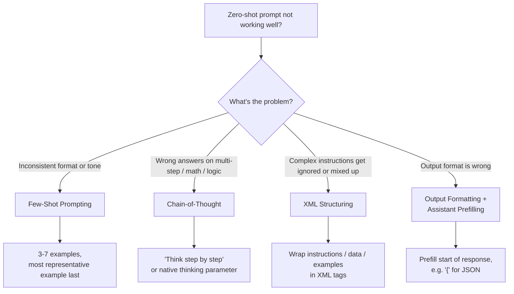

# Advanced Techniques




## Few-Shot Prompting

Provide examples of the input/output pattern you want. Claude generalizes from them.

```
System: You classify customer messages as COMPLAINT, QUESTION, or COMPLIMENT.

User:
Message: "Your app crashed and I lost all my data."
Classification: COMPLAINT

Message: "How do I export my data?"
Classification: QUESTION

Message: "The new design is beautiful!"
Classification: COMPLIMENT

Message: "I've been waiting three days for a response."
Classification:
```

> [!tip] When to use few-shot
> Use it when: (1) zero-shot produces inconsistent formats, (2) the task has subtle rules hard to describe verbally, or (3) you want a specific tone or style Claude hasn't defaulted to.

### Few-Shot Best Practices

- Use 3–7 examples. More is rarely better after ~5.
- Cover edge cases and boundary conditions, not just easy examples.
- Keep examples consistent in format — one deviation teaches Claude that deviation is acceptable.
- Order matters: place the most representative example last (recency bias).

---

## Chain-of-Thought (CoT)

Ask Claude to reason step-by-step before giving a final answer. This dramatically improves accuracy on math, logic, and multi-step problems.

**Zero-shot CoT** — add a trigger phrase:

```
User: A bat and a ball cost $1.10 together. The bat costs $1.00 more than the ball. How much does the ball cost?

Think through this step by step before answering.
```

**Explicit CoT** — structure the reasoning explicitly:

```
User: Solve this problem. Show your work in <thinking> tags, then give your final answer in <answer> tags.

Problem: [...]
```

> [!note] Extended thinking
> Claude supports a native `thinking` parameter that enables a separate reasoning block before the visible response. This is more reliable than prompt-based CoT for complex problems.

---

## XML Structuring

Claude is trained on documents that use XML-like tags for structure. Using tags in prompts significantly improves Claude's ability to parse complex instructions and produce structured output.

```
<document>
  <title>Q3 Sales Report</title>
  <content>
    Revenue increased by 12% year-over-year...
  </content>
</document>

Summarize the <content> in two sentences. Focus on financial performance only.
```

### Use XML tags to:
- Delimit input data from instructions
- Mark sections of long documents
- Separate examples from the actual task
- Signal where output should go

---

## Output Formatting

Tell Claude exactly what format you want. The more specific, the more consistent the output.

| Goal | Instruction |
| ---- | ----------- |
| JSON | "Respond with a valid JSON object only. No prose before or after." |
| Markdown | "Format your response as a Markdown document with H2 headers." |
| Concise | "Answer in one sentence. No preamble." |
| Structured list | "Return a numbered list. Each item: max 15 words." |

**Prefilling** is the strongest enforcement. If you start Claude's response with `{`, it will not add prose before the JSON object.

---

## Prompt Chaining

Break complex tasks into a sequence of smaller prompts, passing outputs as inputs to the next step.

```
Step 1: Extract key facts from the document → facts_list
Step 2: Evaluate each fact for accuracy → verified_facts
Step 3: Write a summary using only verified_facts → final_summary
```

This is more reliable than a single mega-prompt because:
- Each step can be validated before proceeding
- Errors are isolated to one step
- You can insert human-in-the-loop checks between steps

---

## Temperature and Determinism

| Task Type | Recommended Temperature |
| --------- | ----------------------- |
| Code generation, math, extraction | 0 (or very low) |
| Structured data output | 0–0.3 |
| Summarization, Q&A | 0.5–0.7 |
| Creative writing, brainstorming | 0.9–1.0 |

> [!warning] Temperature 0 is not truly deterministic
> Even at temperature 0, Claude may produce slightly different outputs across calls due to floating-point non-determinism in parallel processing. For reproducibility, log inputs and outputs rather than relying on identical results.

---

## Related Notes

- [[01_Prompt_Structure|Prompt Structure]]
- [[03_Prompt_Patterns|Prompt Patterns]]
- [[../../06_Production_and_Evaluation/Theory/03_Evaluation_and_Testing|Evaluation & Testing]]

---

[[../_Index|← Back to Prompt Engineering Index]]
