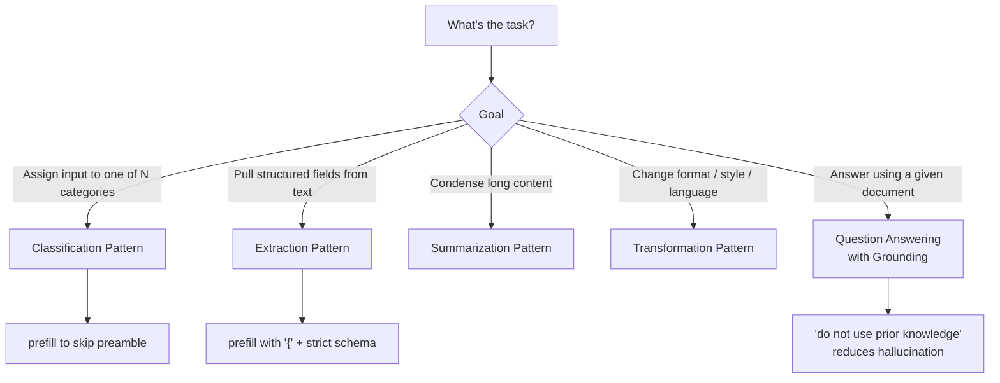

# Prompt Patterns

Reusable prompt templates for common tasks. Each pattern includes a template, when to use it, and a worked example.

---




## Classification Pattern

**When to use:** Assign input to one of N predefined categories.

```
System:
You are a support ticket classifier. Classify each ticket into exactly one of:
BILLING | TECHNICAL | ACCOUNT | FEATURE_REQUEST | OTHER

Respond with only the category name. Nothing else.

User: {{ticket_text}}
```

**Tips:**
- List categories explicitly in the system prompt.
- Use `prefilling` to prevent preamble (start assistant response with empty string or the first letter).
- Add a catch-all (`OTHER`) to handle out-of-scope inputs gracefully.

---

## Extraction Pattern

**When to use:** Pull structured data from unstructured text.

```
System:
Extract the requested fields from the text. Return a JSON object only.
If a field is not present, use null.

User:
Text: {{input_text}}

Extract:
{
  "name": string | null,
  "date": "YYYY-MM-DD" | null,
  "amount": number | null,
  "currency": string | null
}
```

**Tips:**
- Define the exact schema including types and null handling.
- Prefill with `{` to prevent any prose before the JSON.
- For nested structures, include a sample output in the prompt.

---

## Summarization Pattern

**When to use:** Condense long content to key points.

```
System:
Summarize the provided document. Follow these rules:
- Maximum 3 bullet points
- Each bullet: one sentence, max 20 words
- Focus on actionable insights only
- Use plain language, no jargon

User:
<document>
{{document_text}}
</document>
```

**Tips:**
- Always specify the desired length and format.
- Use XML tags to isolate the document from instructions.
- Add an audience constraint ("for a non-technical executive") to control vocabulary.

---

## Transformation Pattern

**When to use:** Convert content from one format/style/language to another.

```
System:
You are a technical writing editor. Rewrite the provided text to match:
- Audience: non-technical business stakeholders
- Tone: confident, professional
- Length: same as original (do not add or remove information)
- Vocabulary: no acronyms, no technical terms

User:
Original: {{technical_text}}
Rewrite:
```

**Tips:**
- Specify what must stay the same (length, information) vs what must change.
- Use the pattern of starting the assistant response with the output label (`Rewrite:`) to skip preamble.

---

## Question Answering with Grounding

**When to use:** Answer questions based on a provided document (RAG responses, document QA).

```
System:
Answer the user's question using only the information in the <context> tags.
If the answer is not in the context, say "I don't have that information."
Do not use prior knowledge.

User:
<context>
{{retrieved_passages}}
</context>

Question: {{user_question}}
```

**Tips:**
- The explicit "do not use prior knowledge" instruction reduces hallucination significantly.
- The fallback instruction ("I don't have that information") prevents confident wrong answers.
- Add a citation instruction to make Claude quote the source passage.

---

## Validation Pattern

**When to use:** Check if input meets a set of criteria and explain why.

```
System:
Evaluate the provided code for the following criteria. For each criterion, output PASS or FAIL and a one-sentence reason.

Criteria:
1. Has type annotations on all function parameters
2. Has a docstring
3. Handles the case where the input list is empty
4. No global variables

User:
```python
{{code}}
```
```

**Tips:**
- Number your criteria for clear mapping in the output.
- Ask for a structured output (table, JSON, numbered list) to make the result parseable.

---

## Anti-Patterns to Avoid

| Anti-Pattern | Problem | Fix |
| ------------ | ------- | --- |
| "Be helpful, harmless, and honest" in system prompt | Redundant — Claude already is. Wastes tokens | Remove; add task-specific instructions instead |
| Very long lists of things not to do | Claude attends poorly to long negative lists | Describe what to do, not just what not to do |
| No format instruction | Inconsistent, verbose output | Always specify format, length, and structure |
| Asking multiple unrelated questions in one prompt | Answers are shorter and less accurate | Split into separate requests |
| "Think step by step" without a reasoning container | Verbose reasoning mixed into final answer | Use `<thinking>` tags or `thinking` parameter |

---

## Related Notes

- [[01_Prompt_Structure|Prompt Structure]]
- [[02_Advanced_Techniques|Advanced Techniques]]
- [[../../03_Tool_Use/Theory/01_Tool_Definition|Tool Definition — structured output via schemas]]

---

[[../_Index|← Back to Prompt Engineering Index]]
