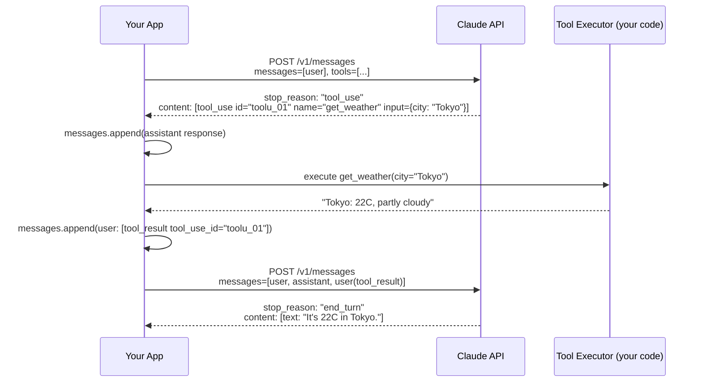
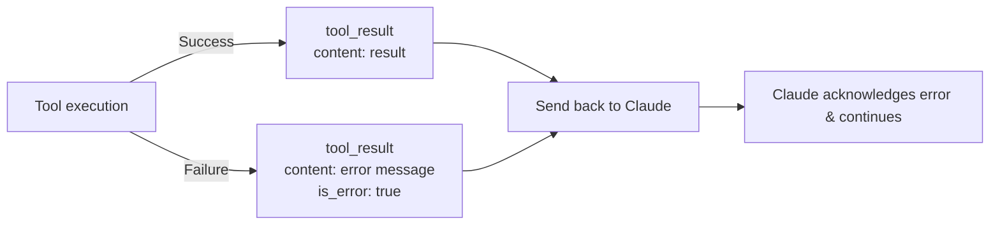

# Tool Call Flow

## The Two-Turn Cycle

Tool use always requires at least two API calls — one for Claude to request the tool, one to give Claude the result.

```
Turn 1: User message + tools definition
  → Claude responds with stop_reason: "tool_use"
  
Turn 2: Append Claude's response + tool_result to messages
  → Claude responds with stop_reason: "end_turn" (or another tool call)
```

---




## Turn 1 — Claude Requests a Tool

When Claude decides to call a tool, the response contains a `tool_use` content block:

```json
{
  "id": "msg_01...",
  "type": "message",
  "role": "assistant",
  "content": [
    {
      "type": "text",
      "text": "Let me check the weather for you."
    },
    {
      "type": "tool_use",
      "id": "toolu_01A09q90qw90lq917835lq9",
      "name": "get_weather",
      "input": {
        "city": "Tokyo"
      }
    }
  ],
  "stop_reason": "tool_use"
}
```

Key fields in the `tool_use` block:

| Field | Description |
| ----- | ----------- |
| `id` | Unique ID for this tool call. **Must be referenced in your tool_result** |
| `name` | The tool name as defined in your tools array |
| `input` | The arguments Claude has constructed, conforming to your `input_schema` |

---

## Turn 2 — Sending the Tool Result

Append the full assistant response to your `messages` array, then add a new `user` message containing the `tool_result`:

```python
# After receiving response from Turn 1:
messages.append({"role": "assistant", "content": response.content})

# Execute the tool
result = get_weather(city="Tokyo")  # your function

# Append the tool result
messages.append({
    "role": "user",
    "content": [
        {
            "type": "tool_result",
            "tool_use_id": "toolu_01A09q90qw90lq917835lq9",  # must match
            "content": f"Tokyo: 22°C, partly cloudy"
      


  }
    ]
})

# Send Turn 2
response2 = client.messages.create(
    model="claude-sonnet-4-6",
    max_tokens=1024,
    tools=tools,
    messages=messages
)
```

---

## Handling Tool Errors

If your tool fails, return an error in the `tool_result` with `is_error: true`. Claude will acknowledge the failure and adjust its response.

```python
{
    "type": "tool_result",
    "tool_use_id": "toolu_01A09q90qw90lq917835lq9",
    "content": "Error: weather service unavailable (503)",
    "is_error": True
}
```

> [!warning] Never silently ignore a tool call
> If you receive `stop_reason: "tool_use"` and do not send back a `tool_result`, the conversation is in a broken state. Always respond to every tool call, even with an error.

---

## Complete Flow in Python

```python
import anthropic
import json

client = anthropic.Anthropic()

tools = [{
    "name": "get_weather",
    "description": "Get the current temperature for a city.",
    "input_schema": {
        "type": "object",
        "properties": {"city": {"type": "string"}},
        "required": ["city"]
    }
}]

def get_weather(city: str) -> str:
    # Replace with a real API call
    return f"{city}: 22°C, partly cloudy"

messages = [{"role": "user", "content": "What's the weather in Tokyo?"}]

while True:
    response = client.messages.create(
        model="claude-sonnet-4-6",
        max_tokens=1024,
        tools=tools,
        messages=messages
    )

    if response.stop_reason == "end_turn":
        # Extract final text response
        for block in response.content:
            if block.type == "text":
                print(block.text)
        break

    if response.stop_reason == "tool_use":
        messages.append({"role": "assistant", "content": response.content})
        tool_results = []
        for block in response.content:
            if block.type == "tool_use":
                result = get_weather(**block.input)
                tool_results.append({
                    "type": "tool_result",
                    "tool_use_id": block.id,
                    "content": result
                })
        messages.append({"role": "user", "content": tool_results})
```

---

## `stop_reason` Decision Table

| `stop_reason` | Action |
| ------------- | ------ |
| `end_turn` | Claude is done. Extract text from content blocks |
| `tool_use` | Execute all tools in content, send results back |
| `max_tokens` | Response truncated. Increase `max_tokens` or redesign |
| `stop_sequence` | Your stop sequence was hit. Handle as end_turn |

---

## Related Notes

- [[01_Tool_Definition|Tool Definition]]
- [[03_Advanced_Tool_Patterns|Advanced Tool Patterns]]
- [[../../01_Claude_Models_and_API/Theory/02_API_Fundamentals|API Fundamentals — stop_reason values]]

---

[[../_Index|← Back to Tool Use & Function Calling Index]]
