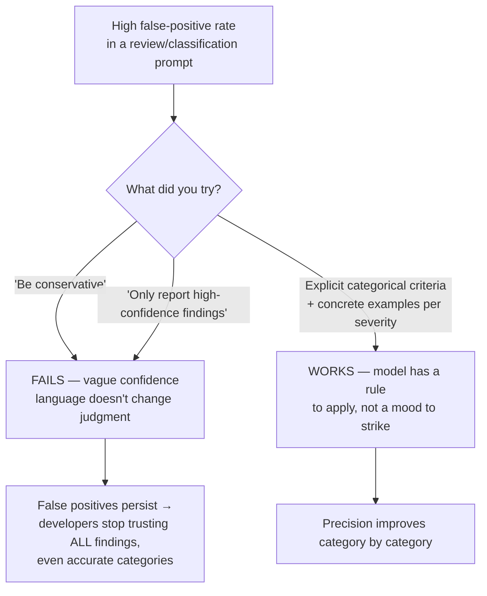
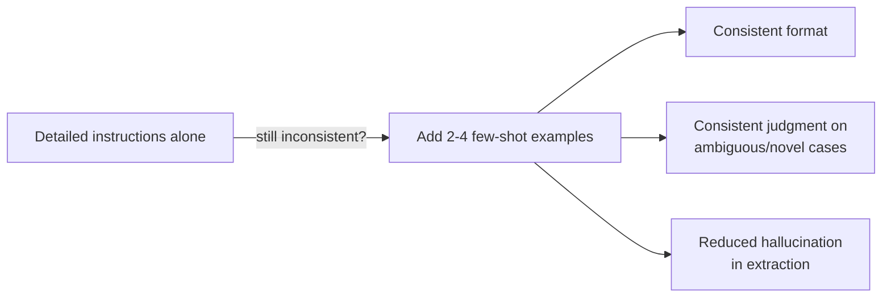

# Precision Prompting & Few-Shot Consistency

> [!important] Task mapping
> This note covers **Task 4.1** (explicit criteria to improve precision and reduce false positives) and **Task 4.2** (few-shot prompting for output consistency). The exam assumes you already know basic prompt structure (`system`/`user`/`assistant` roles, message alternation) — see the recap below if you need it — and tests these two narrower skills instead.

---

## Prerequisite Recap: System vs. User Roles

| Role | Purpose |
| ---- | ------- |
| `system` | Persona, task scope, standing behavioral rules — sent once, applies to the whole request |
| `user` | The specific request or input for this turn |
| `assistant` | Claude's response, or a developer-supplied prefill to steer output |

If this is new to you, the mechanics matter less for this domain than **what goes into the instructions** — that's the exam's real focus. Keep instructions specific and criteria-driven rather than vague, and keep messages alternating `user`/`assistant`.

---

## Task 4.1 — Explicit Criteria Over Vague Instructions



### The core finding

General instructions like **"be conservative"** or **"only report high-confidence findings"** do **not** reliably improve precision. They ask the model to self-calibrate a confidence threshold it cannot measure well. What actually works is replacing vague instructions with **specific, categorical criteria** that state exactly what counts.

> [!example] Vague vs. explicit
> - **Vague:** "Check that comments are accurate." → Claude flags any comment that seems slightly stale, imprecise, or debatable — high false-positive rate.
> - **Explicit:** "Flag a comment only when the claimed behavior contradicts the actual code behavior (e.g., comment says 'returns null on error' but the code throws)." → Claude has a concrete test to apply, not a vibe to guess at.

### Trust is category-scoped, but damage isn't

A high false-positive rate in **one** finding category (say, style nits) erodes developer trust in **all** categories the tool reports — including the accurate ones (say, real security bugs). This is why the fix is often not "make the whole tool more conservative" but:

1. Write specific criteria per category defining what to **report** (bugs, security issues) vs. what to **skip** (minor style preferences, project-local idioms).
2. **Temporarily disable** the specific high-false-positive category while you improve its prompt — this restores trust in the categories that were already working, faster than a global confidence-filter change would.
3. Define **explicit severity criteria with concrete code examples** for each severity level, so classification is consistent across runs and across reviewers.

> [!warning] Confidence-based filtering is a trap
> "Only surface findings you're 90%+ confident about" sounds like a precision lever. It isn't — the model's self-reported confidence doesn't reliably track actual correctness on the category boundary that's causing false positives in the first place. Fix the category's *criteria*, not the *confidence bar*.

### Worked example — severity criteria

```
Severity: CRITICAL
- Data loss, security vulnerability, or crash in the main path.
- Example: SQL query built via string concatenation with user input.

Severity: MAJOR
- Incorrect behavior under common (not edge-case) inputs.
- Example: off-by-one in pagination that skips the last page.

Severity: MINOR — do not report unless explicitly asked
- Style preference, naming convention, or a pattern already used
  elsewhere in this codebase.
- Example: using a for-loop where a list comprehension "would be nicer."
```

Notice this isn't "be more careful" — it's a rule with worked examples the model can pattern-match against.

---

## Task 4.2 — Few-Shot Prompting for Consistency and Generalization

### Why few-shot beats more instructions

When detailed written instructions alone still produce **inconsistently formatted or inconsistently judged** output, few-shot examples are the most effective fix — more effective than adding yet more prose instructions. Examples show the model the exact shape and judgment pattern you want; instructions only describe it.



### What few-shot examples are for in this domain

1. **Ambiguous-case handling.** Show 2-4 examples of genuinely ambiguous scenarios (which tool to call for an underspecified request; whether a branch-level gap in test coverage counts as "needs a test") — each example paired with **reasoning for why one action was chosen over a plausible alternative**. The reasoning is what transfers, not just the input→output pairing.
2. **Generalization to novel patterns.** The payoff of few-shot isn't that the model memorizes your 3 examples — it's that it learns the *judgment principle* behind them and applies it to inputs that don't look like any single example. If your examples only ever get matched verbatim, you haven't demonstrated a principle, you've built a lookup table.
3. **Output-format consistency.** Examples demonstrating the exact desired structure (e.g., `location`, `issue`, `severity`, `suggested_fix` per finding) lock in a format that instructions alone tend to drift from over a long response.
4. **False-positive reduction via contrast.** Include at least one example of an *acceptable* pattern that looks superficially like a violation, next to one that's a genuine issue — this teaches the boundary, not just the positive case.
5. **Reducing hallucination in extraction.** For extraction tasks over messy, informally-structured input (informal measurements like "about a cup", varied document layouts), few-shot examples showing correct handling of that messiness reduce the model's tendency to normalize or invent values that weren't actually stated.
6. **Document-structure variation.** For tasks like citation extraction, include examples covering both inline citations ("(Smith, 2020)") and formal bibliographies — a model shown only one structure will mishandle the other.
7. **Empty/null cases.** Include at least one example where a required-looking field is genuinely absent from the source, and the correct output is `null`/omitted — not a fabricated value. Without this example, models tend to invent something plausible rather than admit absence.

> [!tip] How many examples
> 2-4 **targeted** examples aimed at the actual ambiguous/novel cases you're seeing beats a larger batch of easy, redundant examples. Pick examples that sit *on the boundary* you want Claude to learn, not examples deep in the "obviously correct" interior.

### Worked example — ambiguous tool selection with reasoning

```
User: "What's the status of order 48213, and can you also tell me if
       that customer has any other open tickets?"

Reasoning: This request needs both lookup_order (order status) AND
get_customer (open tickets) because it references the customer behind
the order, not just the order itself. Calling only lookup_order would
silently drop the second half of the request.

Tool calls: lookup_order(order_id="48213"), then
            get_customer(customer_id=<from order>)
```

```
User: "Check my order #91004"

Reasoning: This request is scoped to a single order with no reference
to the customer's broader account, so lookup_order alone is sufficient.
Calling get_customer here would be an unnecessary, unrequested lookup.

Tool calls: lookup_order(order_id="91004")
```

Two examples, same tool pair, opposite decisions — each with a stated reason. This is what teaches the model to generalize the *decision rule* ("does the request reference the customer beyond this one order?") rather than memorizing "always call both" or "always call one."

### Worked example — output format for review findings

```
Example finding:
{
  "location": "auth/session.py:142",
  "issue": "Session token compared with == instead of a constant-time comparison",
  "severity": "CRITICAL",
  "suggested_fix": "Use hmac.compare_digest() instead of =="
}
```

Showing 2-3 of these (spanning severities) in the prompt does more for consistent field population than restating "return JSON with these four fields" in prose.

---

## Related Notes

- [[02_Structured_Output_and_Validation|Structured Output & Validation]] — enforcing the format these examples demonstrate via `tool_use`
- [[03_Batch_Processing_and_Multi_Pass_Review|Batch Processing & Multi-Pass Review]]
- [[../../00_Exam_Guide/Exam_Scenarios|Exam Scenarios]] — Scenario 5 (CI/CD review) and Scenario 1 (escalation calibration) both hinge on this note's content

---

[[../_Index|← Back to Domain 4 Index]]
