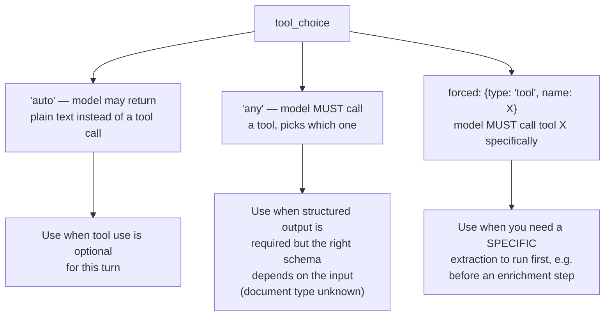
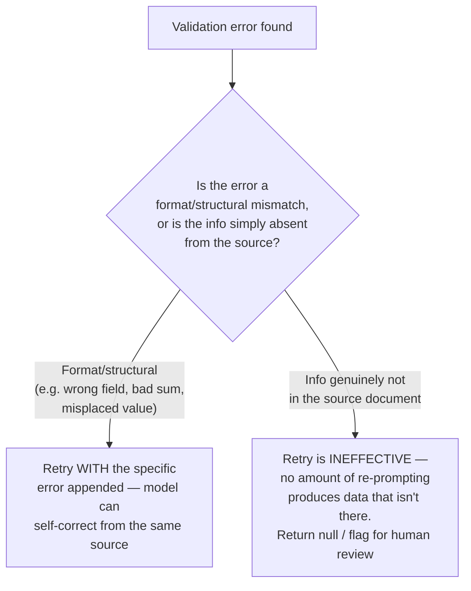

# Structured Output & Validation

> [!important] Task mapping
> This note covers **Task 4.3** (enforce structured output using tool use and JSON schemas) and **Task 4.4** (validation, retry, and feedback loops for extraction quality).

---

## Task 4.3 — `tool_use` as the Reliable Path to Structured Output

### Why `tool_use`, not prompted JSON

Asking Claude to "respond with valid JSON only" and parsing the text is fragile — trailing prose, markdown fences, or a single missing comma break the parse. **`tool_use` with a JSON schema is the most reliable approach for guaranteed schema-compliant output.** The model's output is constrained to the tool's `input_schema`, which eliminates JSON **syntax** errors as a category — you get a typed object back, not a string to parse.

```python
import anthropic

client = anthropic.Anthropic()

extract_invoice = {
    "name": "extract_invoice",
    "description": "Record structured fields extracted from an invoice document.",
    "input_schema": {
        "type": "object",
        "properties": {
            "invoice_number": {"type": "string"},
            "vendor_name":    {"type": "string"},
            "line_items": {
                "type": "array",
                "items": {
                    "type": "object",
                    "properties": {
                        "description": {"type": "string"},
                        "amount":      {"type": "number"}
                    },
                    "required": ["description", "amount"]
                }
            },
            "stated_total":  {"type": "number"},
            "due_date":      {"type": ["string", "null"], "description": "ISO 8601 date, or null if not present in the document"},
            "category": {
                "type": "string",
                "enum": ["utilities", "software", "travel", "office_supplies", "other"],
                "description": "If none of the fixed categories fit, use 'other' and populate category_detail."
            },
            "category_detail": {"type": ["string", "null"]}
        },
        "required": ["invoice_number", "vendor_name", "line_items", "stated_total", "category"]
    }
}

response = client.messages.create(
    model="claude-sonnet-5",
    max_tokens=1024,
    tools=[extract_invoice],
    tool_choice={"type": "tool", "name": "extract_invoice"},
    messages=[{"role": "user", "content": f"Extract the invoice fields.\n\n{document_text}"}]
)

tool_use_block = next(b for b in response.content if b.type == "tool_use")
extracted = tool_use_block.input  # already a typed dict — no string parsing
```

### `tool_choice` modes



| Mode | Behavior | When to use |
| ---- | -------- | ----------- |
| `{"type": "auto"}` | Claude may respond with text instead of calling a tool | Tool use is one option among several valid responses |
| `{"type": "any"}` | Claude must call **a** tool, but chooses which one | You expose several extraction schemas for different document types and don't know in advance which applies — this guarantees structured output without forcing a possibly-wrong schema |
| `{"type": "tool", "name": "extract_metadata"}` | Claude must call **this specific** tool | You need a known extraction to run before a downstream enrichment step depends on its output — e.g., always extract metadata first, then decide on enrichment tools in a later turn |

> [!warning] Syntax-safe is not semantics-safe
> Forcing tool use eliminates malformed JSON. It does **not** validate that the values are *correct*. Claude can still return a schema-valid tool call where line items sum to $940 but `stated_total` is $1,000, or where a phone number ends up in the `fax_number` field. Schema compliance and semantic correctness are separate problems — see Task 4.4 below.

### Schema design principles

- **Required vs. optional/nullable fields.** Only mark a field `required` if it must always be derivable from a well-formed input. If a source document may legitimately lack a piece of information (e.g., a receipt with no due date), make that field nullable (`"type": ["string", "null"]`) rather than required. A required field on absent data pressures the model to **fabricate a plausible-looking value** just to satisfy the schema — nullable fields let it truthfully report "not present."
- **Enum + "other" + detail string, for extensible categories.** A closed `enum` is precise but brittle against inputs that don't fit any listed category. Add an `"other"` value plus a free-text `*_detail` field so the category taxonomy degrades gracefully instead of forcing a wrong bucket.
- **`"unclear"` as an explicit enum value.** For genuinely ambiguous inputs (e.g., sentiment that reads as neither positive nor negative), add `"unclear"` rather than forcing a binary choice — this is more honest than picking one arbitrarily and prevents silent misclassification.
- **Format-normalization rules alongside the schema.** A strict schema constrains *shape*, not *formatting conventions*. If you need dates as `YYYY-MM-DD` or currency without symbols, state that in the prompt text — the schema's `type: string` alone won't enforce it.

---

## Task 4.4 — Validation, Retry, and Feedback Loops

### Retry-with-error-feedback

When a semantic validation check fails after extraction, the effective fix is a **follow-up request that includes**:
1. The original source document (or the relevant excerpt),
2. The failed extraction (what the model returned),
3. The **specific validation error** (not a generic "try again").

```python
def extract_with_retry(document_text: str, max_retries: int = 2):
    messages = [{"role": "user", "content": f"Extract the invoice fields.\n\n{document_text}"}]

    for attempt in range(max_retries + 1):
        response = client.messages.create(
            model="claude-sonnet-5",
            max_tokens=1024,
            tools=[extract_invoice],
            tool_choice={"type": "tool", "name": "extract_invoice"},
            messages=messages,
        )
        tool_block = next(b for b in response.content if b.type == "tool_use")
        result = tool_block.input

        error = validate_semantics(result)  # e.g. checks sum(line_items) == stated_total
        if error is None:
            return result

        if attempt == max_retries:
            return {"result": result, "unresolved_error": error}

        # Append assistant's tool call + the tool_result carrying the specific error,
        # so the next turn can self-correct with exact feedback.
        messages.append({"role": "assistant", "content": response.content})
        messages.append({
            "role": "user",
            "content": [{
                "type": "tool_result",
                "tool_use_id": tool_block.id,
                "content": f"Validation failed: {error}. Re-extract, resolving this discrepancy against the original document.",
                "is_error": True,
            }],
        })
    return None
```

### When retries help — and when they can't



- **Retries work** for format/structural errors: values in the wrong field, a total that doesn't match the sum of its parts, a date in the wrong format. These are errors *of interpretation* — the information exists in the source, the model just placed or computed it wrong the first time, and specific feedback lets it re-read and fix it.
- **Retries do not work** when the required information is simply **absent from the source**. Re-prompting a model with "the due_date field is missing, please try again" against a document that never states a due date will not produce a correct date — it will more likely produce a fabricated one. The correct handling is a nullable field (see Task 4.3) plus, if the field is business-critical, routing to human review rather than looping the API call.

### Self-correction flow design

Two patterns show up repeatedly for catching semantic errors without an external validator:

1. **Extract both a stated and a calculated value, and flag the discrepancy.** Alongside `stated_total`, also have the schema require `calculated_total` (line items summed) or compute it in your own code. If they disagree, you have a `conflict_detected` boolean or a discrepancy amount you can surface — without needing a second model call to "double check."
2. **`conflict_detected` booleans for inconsistent source data.** When a source document itself contains contradictory information (two different totals printed on the page, a name spelled two ways), have the extraction schema include a boolean flag plus a note — this is different from an *extraction* error, since the model correctly read the source; the source itself is inconsistent.

### `detected_pattern` fields for feedback-loop analysis

For structured findings (e.g., a code-review tool), add a `detected_pattern` field to each finding that records **what triggered it** (e.g., `"string_concatenation_in_sql"`, `"missing_null_check_before_deref"`). This doesn't help the current extraction — it builds a feedback loop: aggregate `detected_pattern` values against which findings developers dismiss as false positives, and you can identify *which specific patterns* are driving false-positive rates (connects back to Task 4.1's per-category precision fixes) instead of only knowing the aggregate false-positive rate.

> [!example] Semantic vs. syntax error, side by side
> - **Syntax error** (already eliminated by `tool_use`): `{"stated_total": "940.00"` — truncated/invalid JSON. Never happens with forced tool use.
> - **Semantic error** (tool use does NOT catch this): `{"stated_total": 940.00, "line_items": [{"amount": 500}, {"amount": 500}]}` — schema-valid, but 500 + 500 ≠ 940. Requires your own validation logic plus a retry-with-feedback loop.

---

## Related Notes

- [[01_Precision_and_Few_Shot_Prompting|Precision & Few-Shot Prompting]] — few-shot examples that demonstrate the output format enforced here
- [[03_Batch_Processing_and_Multi_Pass_Review|Batch Processing & Multi-Pass Review]] — applying validation/retry at scale
- [[../../00_Exam_Guide/Exam_Scenarios|Exam Scenarios]] — Scenario 6 (Structured Data Extraction) is built entirely around this note

---

[[../_Index|← Back to Domain 4 Index]]
