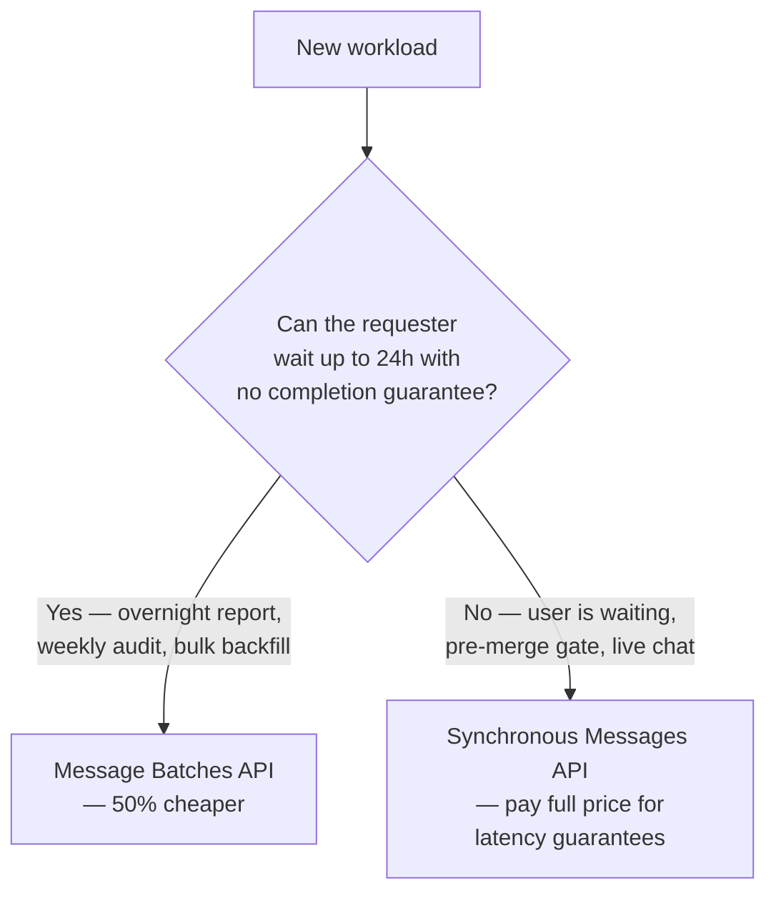
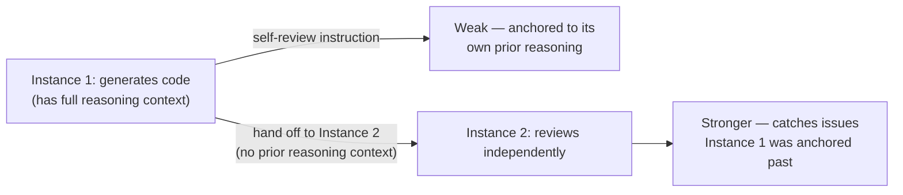

# Batch Processing & Multi-Pass Review

> [!important] Task mapping
> This note covers **Task 4.5** (design efficient batch processing strategies) and **Task 4.6** (design multi-instance and multi-pass review architectures).

---

## Task 4.5 — Message Batches API

### What it trades away, and for what

The Message Batches API processes a large set of requests asynchronously for a **50% cost discount**, with **up to a 24-hour processing window** and **no guaranteed latency SLA** — a batch could return in minutes or take most of a day, and you cannot rely on it returning faster just because the queue is short.



| | Synchronous Messages API | Message Batches API |
| - | ------------------------- | -------------------- |
| Cost | Full price | 50% discount |
| Latency | Returns per-request, real time | Up to 24h, no SLA |
| Fits | Blocking workflows: pre-merge checks, interactive chat, anything a human or downstream system is actively waiting on | Non-blocking, latency-tolerant workloads: overnight reports, weekly audits, large-scale document backfills |
| Multi-turn tool calling | Fully supported — execute a tool, feed the result back, continue | **Not supported within a single batch request** — you cannot execute a tool mid-request and return results inside that same call |

> [!warning] The classic wrong answer
> Proposing to batch a **blocking** workflow (e.g., a pre-merge CI check developers are actively waiting on) "because it's 50% cheaper" is the textbook distractor on this topic. The cost savings are real but irrelevant if the workflow cannot tolerate unpredictable multi-hour latency. Batch the overnight/weekly workload; keep the blocking check synchronous.

### `custom_id` for correlation

Every request in a batch carries a `custom_id` you assign; the corresponding response carries the same `custom_id` back. This is how you match responses to the original requests once the batch completes — responses are not guaranteed to come back in submission order.

```python
import anthropic

client = anthropic.Anthropic()

requests = [
    {
        "custom_id": f"doc-{doc.id}",
        "params": {
            "model": "claude-sonnet-5",
            "max_tokens": 1024,
            "tools": [extract_invoice],
            "tool_choice": {"type": "tool", "name": "extract_invoice"},
            "messages": [{"role": "user", "content": doc.text}],
        },
    }
    for doc in documents
]

batch = client.messages.batches.create(requests=requests)
# Poll batch.processing_status until "ended", then stream results:
for result in client.messages.batches.results(batch.id):
    doc_id = result.custom_id  # correlate back to the source document
    if result.result.type == "succeeded":
        handle(doc_id, result.result.message)
    else:
        queue_for_resubmission(doc_id, result.result)
```

### Handling batch failures

When individual requests in a batch fail (e.g., a document too large for the context window), **resubmit only the failed `custom_id`s** with the underlying issue fixed (e.g., chunk the oversized document into parts, resubmit each chunk as its own `custom_id`) — not the entire batch. Batches are typically large enough that a full resubmission wastes the discount you already paid for on the requests that succeeded.

### Prompt refinement before scaling up

Before submitting a large volume to batch processing, run your prompt (extraction schema, few-shot examples, validation criteria) against a **small sample set synchronously** first. Batches don't support the interactive iterate-and-inspect loop you'd use to catch a bad prompt early — discovering a systemic issue only after a 24-hour batch completes is expensive in both time and in requests that now need resubmission. Get first-pass success high on the sample before you commit the full volume.

### SLA math — sizing your submission cadence

If you must guarantee results within a fixed external SLA and are using a batch API with an up-to-24-hour window, your **submission frequency**, not just the batch window, determines the guarantee.

> [!example] Worked example
> Target: guarantee results within **30 hours** of a document arriving. Batch processing takes up to 24h.
> Budget for processing: 30h − 24h = **6h of slack** for documents to sit before being included in a submission.
> To guarantee no document waits more than 6h before being swept into a batch, you must submit **at least every 6 hours** — a document arriving just after a submission waits up to 6h for the next submission window, then up to 24h to process, totaling ≤30h.
> A common exam-style trap number in this shape: if the guide gives a **4-hour** submission cadence against a 24h batch window, that yields a 28h worst case — check the arithmetic against the actual stated SLA rather than assuming a round submission number is automatically correct.

---

## Task 4.6 — Multi-Instance & Multi-Pass Review Architectures

### Why self-review underperforms

A model that just generated code (or an extraction, or a plan) retains the reasoning context from that generation in the same session. This makes it **less likely to question its own decisions** — it tends to re-confirm the assumptions it already made rather than notice they were wrong, even when explicitly instructed to "review your own work critically" or given extended thinking to reconsider. The instruction to self-critique doesn't remove the anchoring effect of having just produced the answer.



**Independent review instances** — a second Claude call that receives the output to review but not the first instance's reasoning trace or conversation history — catch subtle issues more reliably than self-review instructions or extended thinking within the same session. The independence is what matters: a fresh context with no investment in the prior answer being right.

> [!tip] Practical pattern
> Generator instance produces code/output → discard its reasoning context → new instance receives *only* the output (plus relevant spec/requirements) and reviews it cold, as if it had never seen the generation process. This mirrors why human code review is normally done by someone other than the author.

### Multi-pass review for large scope

A single review pass over many files at once suffers **attention dilution**: depth of analysis becomes inconsistent across files, and the same pattern can be flagged as a bug in one file while being silently approved in another within the same pass — a form of self-contradiction caused by trying to hold too much simultaneously.

The fix is to split the review into separate passes with different scopes:

1. **Per-file local-analysis passes** — each file (or small file group) reviewed for issues that are visible within that file alone: logic bugs, missing null checks, style violations.
2. **A separate cross-file integration pass** — reviewing how the files interact: data flowing between them, contract mismatches, whether a function's callers were all updated consistently.

This is a task-decomposition fix, not a bigger-model or bigger-context-window fix. Feeding the same 14 files into a single pass with a larger context window does not resolve attention dilution — the problem is analysis depth per unit of attention, not whether everything technically fits.

> [!warning] A related over-engineered distractor
> "Run 3 independent passes, only flag findings that appear in ≥2 of 3" sounds like it would improve reliability through redundancy, but it suppresses real, intermittently-caught issues — it optimizes for reviewer agreement, not correctness. It doesn't address the actual root cause (dilution from reviewing too much per pass) and can make the review architecture strictly worse for genuine but subtle bugs.

### Calibrated confidence for review routing

Have the review instance **self-report a confidence level alongside each finding**, not as a substitute for explicit criteria (Task 4.1 covers why raw "be confident" filtering fails) but as a *routing* signal: high-confidence findings can auto-post as PR comments, low-confidence findings route to a human reviewer for a final call. This uses confidence for triage of *where a human looks*, not as the precision mechanism itself — the precision mechanism is still explicit per-category criteria.

---

## Related Notes

- [[01_Precision_and_Few_Shot_Prompting|Precision & Few-Shot Prompting]]
- [[02_Structured_Output_and_Validation|Structured Output & Validation]]
- [[../../00_Exam_Guide/Exam_Scenarios|Exam Scenarios]] — Scenario 5 (CI/CD, independent review instance) and the batch-API sample questions in [[../../00_Exam_Guide/Official_Sample_Questions|Official Sample Questions]]

---

[[../_Index|← Back to Domain 4 Index]]
